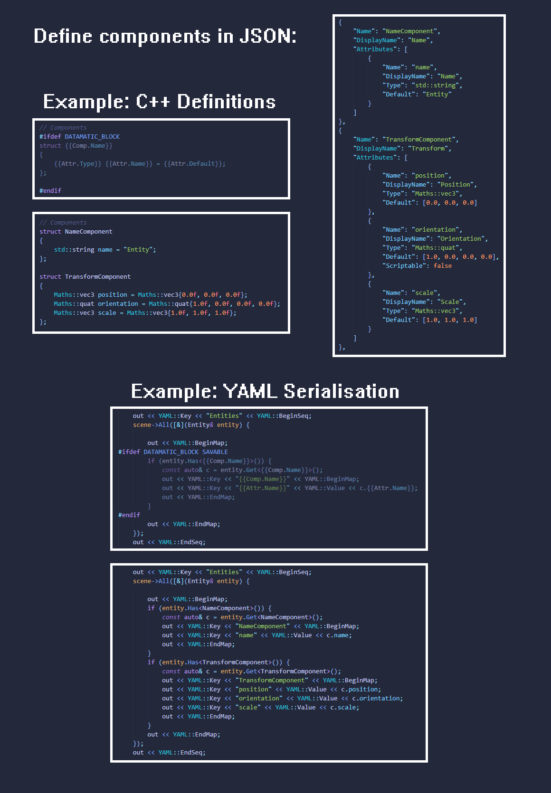
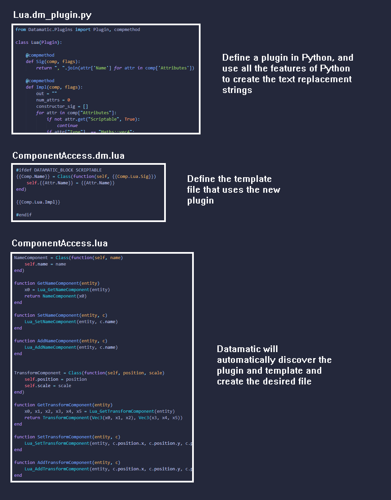

# Datamatic

A python package for generating C++ and Lua source code.

## Motivation

This is a tool designed to help with another project of mine where I am creating a game engine from scratch. That engine uses an ECS (Entity Component System), and
I kept finding areas where I needed to loop over all component types to implement logic, for example, exposing components to Lua, and displaying them withing an ImGui
editor window. This made adding new components very cumbersome.

With this tool, components can be defined in a json file, and C++ and Lua source templates can be provided which will be used to generate the actual files with the
components added in. I'm aware there existing tools out there for this job, but I thought it would be a fun exercise to implement my own.


## Usage

Running Datamatic is very simple. It has no external dependencies so can just be cloned and ran on a repository as follows:
```
python3.8 Datamatic.py --spec <path/to/json/spec> --dir <path/to/project>
```

Datamatic will then recurse through the entire directory looking for files with extensions `*.dm.*`, and use those as templates for generating source code, which it 
will place alongside the template files with the `.dm` removed. So far, it has been tested with `.dm.h`, `.dm.cpp` and `.dm.lua` files.




### Plugins

The syntax for Datamatic is very simple, and as such it may not be capable of generating the desired code. To this end, it is possible to create Plugins to allow
users to define text replacement functions using the full power of Python:

